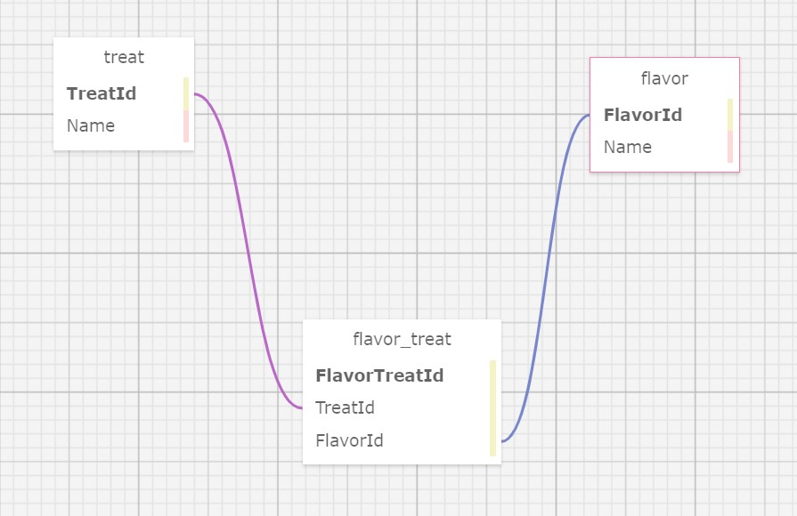

# Pierre's Treats 

#### By _**Karl Starkweather**_

#### _An application for users to track flavors and treats available at Pierre's Bakery._

## Technologies Used

* C#
* .NET 5.0
* dotnet
* MySql/Workbench
* Entity Core
* Identity

## Description

This application allows users to see the full range of treats offered by Pierre, and organized by Flavor. All elements can be viewed without signing in, but cannot be modified without a valid login. At which point a user may:
* add treats
* assign treats to multiple flavors
* remove flavors and delete treats
* add flavors
* assign multiple treats to flavors
* remove flavors

## Database Structure



## Setup/Installation Requirements
* Clone the software from the GitHub repository
    - Open the terminal on your local machine and navigate to where you want to clone the project
    - Enter following command: <code> git clone https://github.com/KarlStarkweather/Pierre-s-Treats.git </code>

* Make sure to have dotnet-ef installed too.<br>
    - Enter <code> dotnet-ef --version </code> in the terminal if you are not sure whether you have it
    - If not installed, then enter:
        - <code> dotnet add package Microsoft.EntityFrameworkCore -v 5.0.0 </code>
        - <code> dotnet add package Pomelo.EntityFrameworkCore.MySql -v 5.0.0-alpha.2 </code>
* Setup/Import the data files
    - Enter <code> dotnet ef database update </code>   
* Open the project in VScode or your terminal/IDE of choice.
* Create a <code>appsettings.json</code> file in the root directory of the project folder. And add the following code replacing anything in square brackets with the information it represents specific to the project database:
```
{
  "ConnectionStrings": {
    "DefaultConnection": "Server=localhost;Port=3306;database=[DATABASE-NAME-HERE];uid=[USER-ID-HERE];pwd=[YOUR-PASSWORD-HERE];"
  }
}

```

* Now using your IDE navigate into the PierresTreats/ folder and use the command <code>dotnet run</code> to launch the program. 
* The site should be available at the server address you used in the <code>appsettings.json</code> folder.


## Known Bugs

* _No known bugs_

## Contact Me

Let me know if you run into any issues or have questions, ideas or concerns:  
stark13@usa.net

## License


Copyright (c) February 2022 Karl Starkweather.
[MIT License](https://opensource.org/licenses/MIT)

